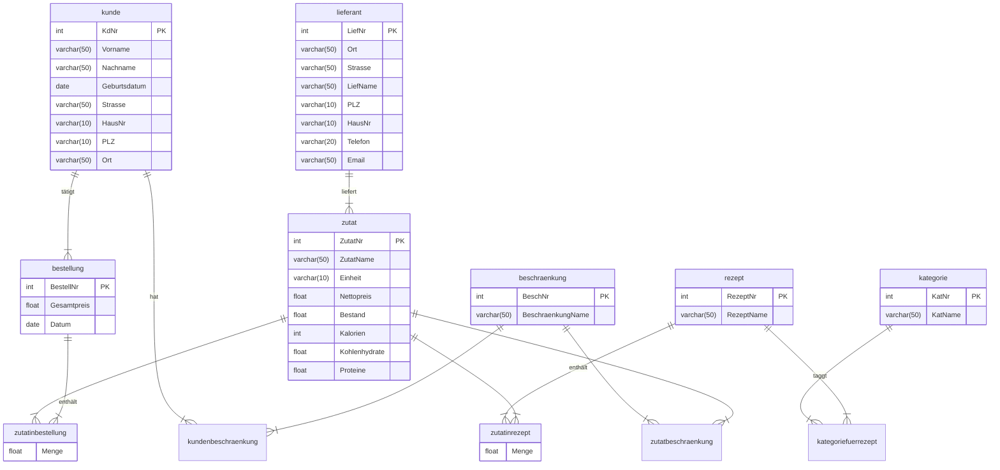

# bh3_krautundrueben
Kraut und Rüben ITECH

```mermaid
erDiagram
  %% Kann ein Kunde nicht auch existieren, ohne eine Bestellung getätigt zu haben?
	kunde ||--|{ bestellung : "tätigt"
	kunde {
    int KdNr PK
		varchar(50) Vorname
    varchar(50) Nachname
    date Geburtsdatum
    varchar(50) Strasse
    varchar(10) HausNr
    varchar(10) PLZ
    varchar(50) Ort
	}
  bestellung {
    int BestellNr PK
    float Gesamtpreis
    date Datum
  }
  zutat ||--|{ zutatinbestellung : ""
  bestellung ||--|{ zutatinbestellung : "enthält"
  zutatinbestellung {
    float Menge
  }
  zutat {
    int ZutatNr PK
    varchar(50) ZutatName
    varchar(10) Einheit
    float Nettopreis
    float Bestand
    int Kalorien
    float Kohlenhydrate
    float Proteine
  }
  %% Liefern nicht mehrere Lieferanten dieselbe Art von Zutat?
  lieferant ||--|{ zutat : "liefert"
	lieferant {
    int LiefNr PK
		varchar(50) Ort
    varchar(50) Strasse
    varchar(50) LiefName
    varchar(10) PLZ
    varchar(10) HausNr
    varchar(20) Telefon
    varchar(50) Email
  }
  %% --- Neue Anforderungen ab hier --- %%
  rezept {
    int RezeptNr PK
    varchar(50) RezeptName
  }
  zutatinrezept {
    float Menge
  }
  kategorie {
    int KatNr PK
    varchar(50) KatName
  }
  kategoriefuerrezept {}
  beschraenkung {
    int BeschNr PK
    varchar(50) BeschraenkungName
  }
  kundenbeschraenkung {}
  zutatbeschraenkung {}
  kunde ||--|{ kundenbeschraenkung : "hat"
  beschraenkung ||--|{ kundenbeschraenkung : ""
  rezept ||--|{ zutatinrezept : "enthält"
  zutat ||--|{ zutatinrezept : ""
  kategorie ||--|{ kategoriefuerrezept : "taggt"
  rezept ||--|{ kategoriefuerrezept : ""
  beschraenkung ||--|{ zutatbeschraenkung : ""
  zutat ||--|{ zutatbeschraenkung : ""
```